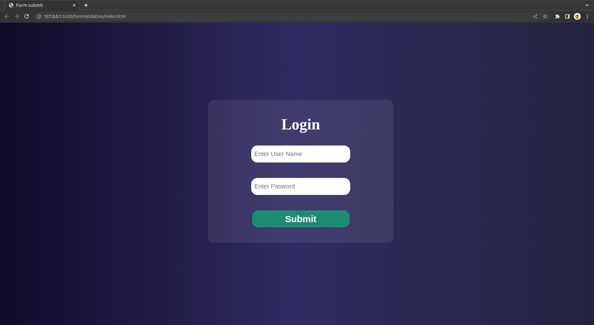
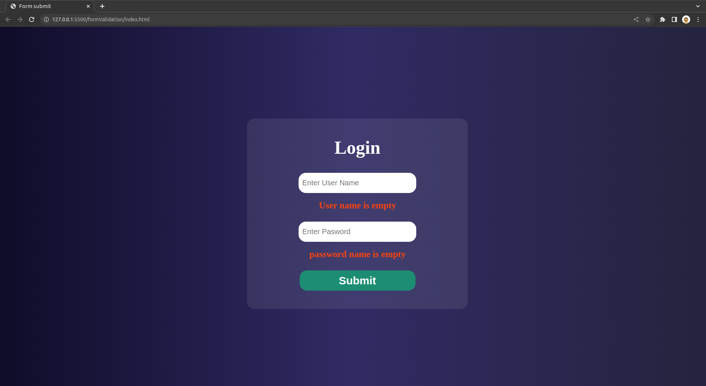
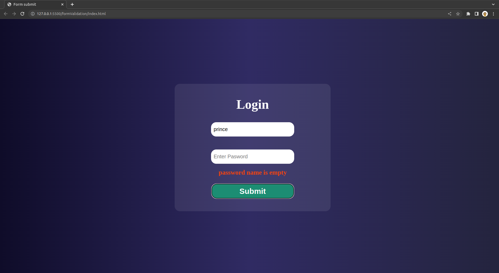
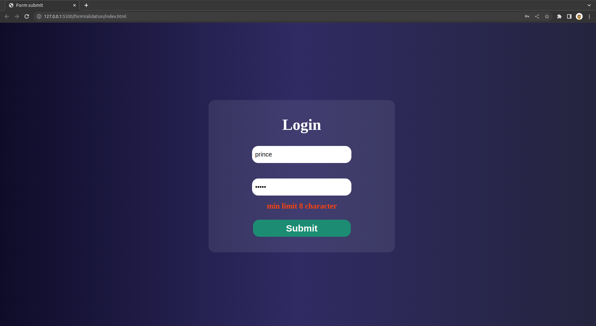

# Local form Validator | JavaScript

By Prince Kr Paswan

## [Link to the Local form Validator](https://shade-up-prince.netlify.app/)

## How it will help you?

This validate the form locally 

## This project took around 3 hours to complete.